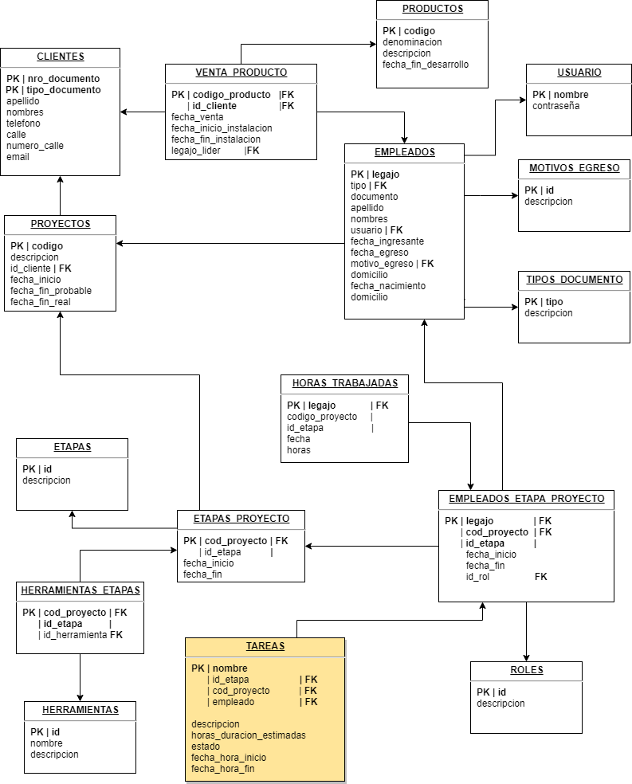

# Trabajo-Practico-PAV

<strong>Curso:</strong> PAV 3k3

<strong>Docente:</strong> Liberatori Marcelo Sadi

<strong>JTP:</strong> Demiano Luis Esteban

<strong>Integrantes:</strong>
- Alemán Fernando Ebert 80753
- Britos Candela Milagros 75843
- Wismer Axel Francis 75930
- <s>Pescetti Sabrina 55121</s>
- <s>Rodriguez Milena Florencia 81313</s>
- <s>Valdemarca Dante 79956</s>

<strong>Razón Social de la Empresa:</strong> NewWare Soft

<strong>Objetivo del sistema:</strong> Brindar información sobre el proceso de
desarrollo de un proyecto de software y la venta de productos de
software estándar y a medida, la gestión del personal, las
herramientas en los proyectos y los clientes de la empresa.

<strong>Alcances</strong>
- Administración de usuarios y perfiles
- Administración del personal
- Administración de cargos o roles
- Administración de herramientas para el desarrollo
- Administración de clientes
- Gestión de etapas de desarrollo
- Gestión de proyectos
- Gestión de productos
- Gestión de tareas por etapas de desarrollo
- Gestión de trabajo de empleados
- Generación de estadísticas reportes y resúmenes

<strong>Estructura de datos</strong>

